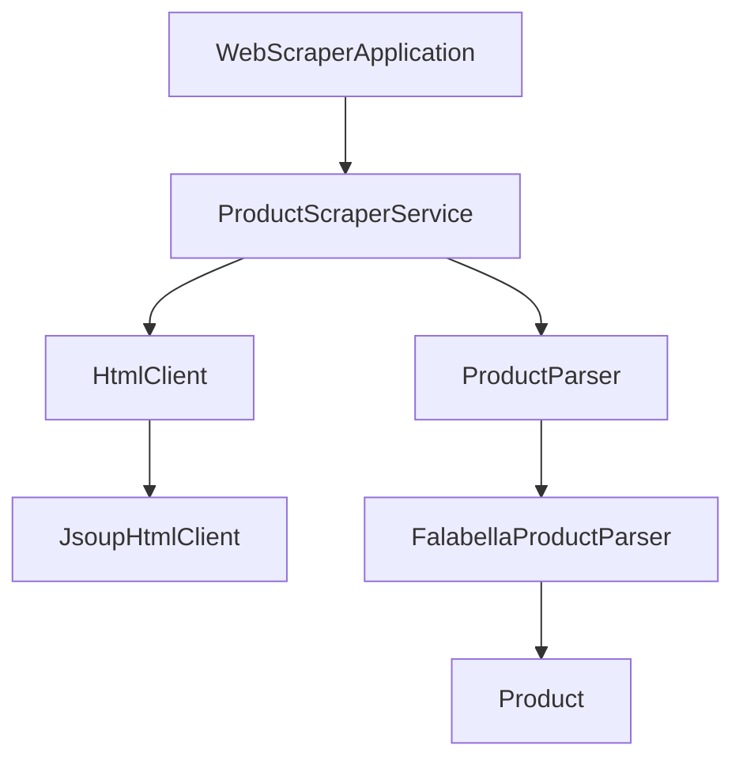
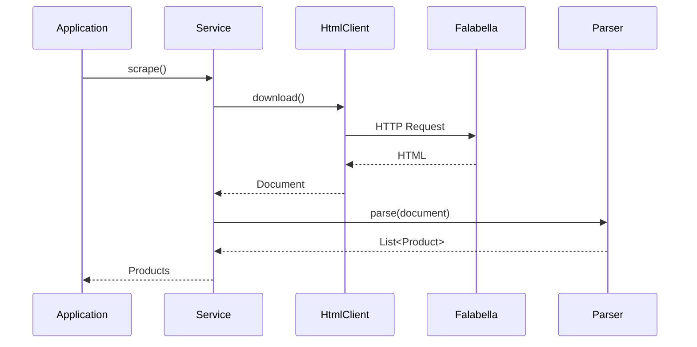

<div align="center">

# 🛒 Web Scraper Falabella

### Hito 1 • Pure Domain Core • Clean Architecture • Java 21

---


---

*A modular web scraper developed in Java 21 following Clean Architecture, Dependency Inversion and Test Driven Development.*

</div>

---

# 📖 Overview

**Web Scraper Falabella** is a console application that retrieves the HTML of a product category from **Falabella Chile**, parses its content using **Jsoup**, and transforms the extracted information into immutable domain objects.

This project corresponds to **Hito 1**, whose objective is to demonstrate the implementation of a **Pure Domain Core**, **Clean Architecture**, rigorous **JUnit 5** unit testing, **Mockito** isolation and business logic coverage through **JaCoCo**.

---

# 🎯 Hito 1 Objectives

This repository focuses exclusively on the requirements defined for **Hito 1**.

- ✔ Pure Domain Core
- ✔ Clean Architecture
- ✔ Dependency Inversion
- ✔ Constructor Injection
- ✔ JUnit 5
- ✔ Mockito
- ✔ AAA Testing Pattern
- ✔ Business Exception Testing
- ✔ JaCoCo Coverage
- ✔ Branch Coverage

---

# 🏗 Architecture

The project follows **Clean Architecture (Ports & Adapters)**.

Business logic is completely isolated from external technologies.



The domain never depends on infrastructure.

Infrastructure depends on the domain.

---

# 📂 Project Structure

```
src
│
├── main
│
│   ├── application
│   ├── domain
│   ├── infrastructure
│   ├── port
│   └── WebScraperApplication.java
│
└── test
    ├── application
    ├── domain
    ├── infrastructure
```

---

# ✅ Hito 1 Requirements Compliance

## 1️⃣ Pure Domain Core

**Requirement**

> The business model must not depend on frameworks, databases or web technologies.

**Implementation**

- Domain objects are Plain Java Objects.
- No Spring annotations.
- No JPA annotations.
- No framework dependencies inside the domain.

✔ Requirement satisfied.

---

## 2️⃣ English Nomenclature

**Requirement**

> Packages, classes, methods, variables and internal exception messages must be written in English.

**Implementation**

Examples:

```
Product
HtmlClient
ProductParser
ProductScraperService
JsoupHtmlClient
```

✔ Requirement satisfied.

---

## 3️⃣ Dependency Inversion

**Requirement**

> Business logic must depend on abstractions rather than implementations.

**Implementation**

```
ProductScraperService
        │
        ├── HtmlClient
        │
        └── ProductParser
```

Concrete implementations:

- JsoupHtmlClient
- FalabellaProductParser

Business services never depend directly on Jsoup.

✔ Requirement satisfied.

---

## 4️⃣ Constructor Injection

**Requirement**

> Dependencies must be injected through constructors.

Example:

```java
public ProductScraperService(
        HtmlClient htmlClient,
        ProductParser parser
)
```

No dependency injection framework is used.

✔ Requirement satisfied.

---

# 🔄 Application Flow



---

# 📦 Domain Model

```
Product

├── Store

├── Name

├── Price

├── Previous Price

├── Discount

└── Source URL
```

The domain is immutable and independent of external libraries.

---

# 🧪 Testing & Quality Assurance

The project includes a complete automated unit testing suite using **JUnit 5** and **Mockito**.

### Testing Strategy

- ✔ Unit Tests
- ✔ Mockito Isolation
- ✔ Constructor Injection
- ✔ Dependency Mocking
- ✔ Defensive Programming

---

## AAA Pattern

All unit tests follow the **Arrange – Act – Assert** pattern.

```
Arrange

↓

Act

↓

Assert
```

✔ Requirement satisfied.

---

## Business Exceptions

Business rules are verified using exception assertions.

Example:

```java
assertThrows(
        IllegalArgumentException.class,
        () -> ...
);
```

✔ Requirement satisfied.

---

## Mockito

External dependencies are fully isolated through Mockito.

No real HTTP connections are required during unit testing.

✔ Requirement satisfied.

---

# 📊 Code Coverage

The project uses **JaCoCo** to verify business logic coverage.

Coverage objectives:

- ✔ Line Coverage
- ✔ Branch Coverage
- ✔ Business Logic Coverage

---

# 🚀 Commands

## Compile

```bash
mvn clean compile
```

---

## Execute Unit Tests

```bash
mvn clean test
```

---

## Generate JaCoCo Report

```bash
mvn clean test jacoco:report
```

---

# 📁 Coverage Report

After executing JaCoCo, open:

```
target/site/jacoco/index.html
```

---

# 📊 Technologies

| Technology | Purpose |
|------------|---------|
| Java 21 | Programming Language |
| Maven | Dependency Management |
| Jsoup | HTML Download & Parsing |
| JUnit 5 | Unit Testing |
| Mockito | Dependency Mocking |
| JaCoCo | Code Coverage |

---

# 🎯 Design Principles

The project was developed following modern software engineering practices.

- SOLID
- Clean Code
- DRY
- KISS
- Separation of Concerns
- Dependency Inversion
- Constructor Injection
- Immutable Objects
- Defensive Programming

---

# 📸 Evidence

## Console Execution


---

## JaCoCo Report


---

## HTML Parsing


---

## Project Structure


---

## Unit Tests


---

# 👨‍💻 Author

**Diego Reyes**

---

<div align="center">

# ✅ Hito 1 Completed

### Pure Domain Core • Clean Architecture • Java 21 • JUnit 5 • Mockito • JaCoCo

⭐ Developed following professional software engineering practices.

</div>
